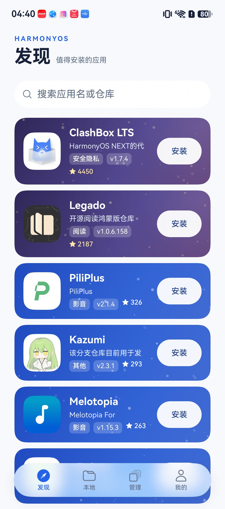
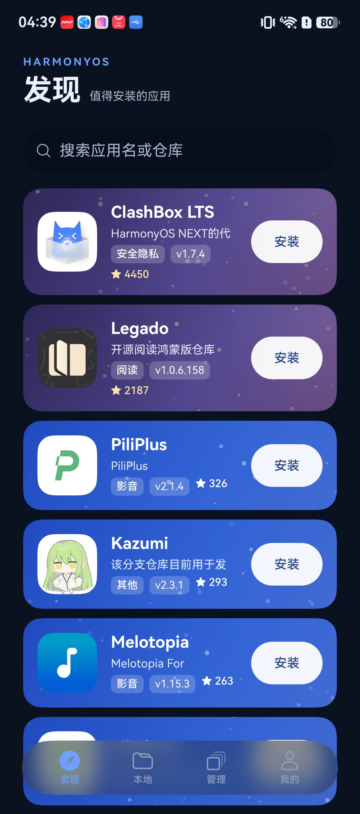
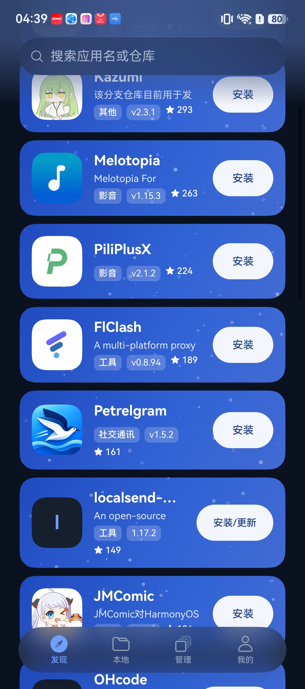
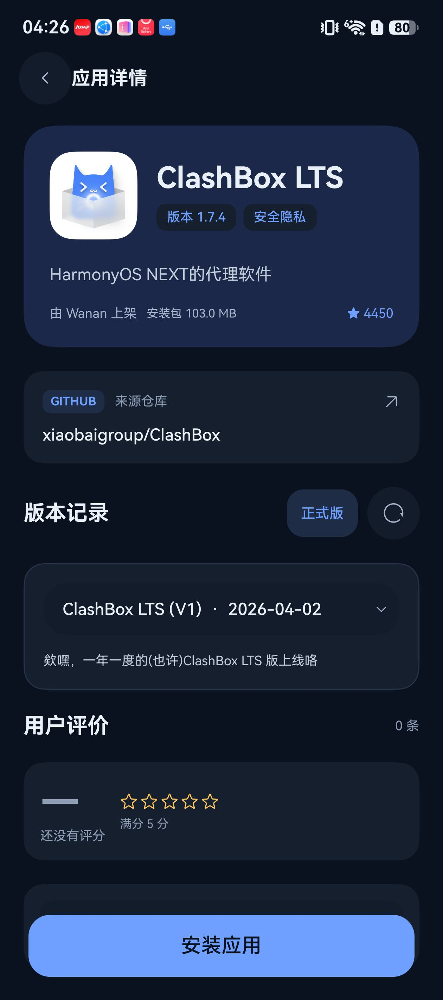
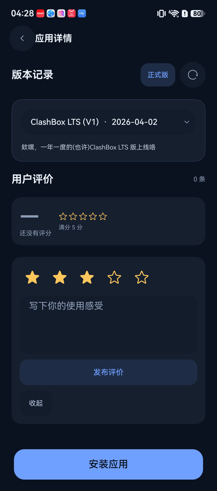
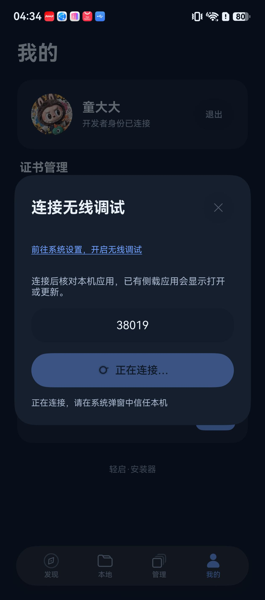

# 0.4.48 预览版：页面自检

## 本轮实现

| 维度 | 调整与核对 |
| --- | --- |
| 排版 | 四个主页面共用边距和标题尺度；详情保留原应用名字大小，版本、分类、上架者、大小分组；长名称省略、标签可换行。 |
| 留白 | 内容最大宽度 720vp，弹窗最大宽度 520vp；窄屏边距 16vp、普通屏幕 24vp；去除搜索框外层框、冗余关闭按钮和版本数量。 |
| 视觉层级 | 安装按钮保持右侧垂直居中，星数回到分类、版本信息区；队列操作独占下一行；评论编辑器与阅读列表分离。 |
| 色彩 | 深浅主题统一语义色；提高次级文字、金色星数和分级卡片对比度；减少星点密度，千星与万星使用不同渐变光晕。 |
| 动效 | 浮层 180ms 淡入与小幅位移；有真实计数的进度使用原生平滑进度，无可靠计数的阶段使用细流光；连接加载动画位于按钮内。 |
| 微交互 | 原生按钮提供按压反馈；图标操作具有读屏名称和 44vp 触摸区域；连接端口居中、保留上次值；提交期间锁定可变输入，避免改变提交内容。 |
| 响应式 | 主页面与详情限制阅读宽度；上架、配置弹窗可滚动；星光背景按卡片实际高度绘制，标签换行不再露出色带；安全区随窗口变化更新。 |
| 原创性与平台体验 | 保留应用星光分级与鸿蒙 HDS 浮动光感导航；搜索直接使用原生材质，顶部只添加随滚动显现的渐变模糊；全屏窗口及状态栏透明。 |

API 26 及支持沉浸材质的设备采用原生沉浸光感；API 24 使用原生薄材质模糊。页面启动、主题切换和从设置返回时重新应用透明系统栏，避免系统重新添加导航底色。

## 验证

- 干净构建完成 33 项任务；225 项客户端回归、3 项无签名校验测试通过。
- 最终公开 HAP 的包名为 `com.tonghongxiang.hapstore`，版本 `0.4.48-preview.1`，构建码 `2026100108`。递归检查无签名，本产物没有内嵌 HAP。
- 最终产物使用本地现有证书经官方 SDK 签名与验签后，在 HarmonyOS 6.1 / API 24 设备覆盖安装；没有卸载或清除用户数据。
- 最终包实机确认发现页深浅主题、星数位置、右侧按钮居中、长标签换行及滚动吸顶。上一候选包已实测详情、评论星级选择、本地页面、管理页面、上架表单、配置选择框及证书列表。
- 实测无线调试释放与重连：预填端口、按钮内加载动画、成功关闭弹窗；恢复浅色主题。
- 上架表单与评论区仅验证交互，没有向线上发布测试应用或评论。队列布局通过代码及回归核对，本轮未执行新的端到端应用签名安装。
- 本轮未实测 HarmonyOS 7.0、平板、折叠屏及一万星以上真实应用；对应布局和配色经过代码检查，仍需后续设备验证。

这里将奖项评审维度作为自检标准，不表示获得奖项或外部评审认证。

## 最终页面证据

## 参考

- [HarmonyX 原生窗口与页面实现](https://github.com/haohaoai0/HarmonyX)
- [OpenHarmony 背景与混合蒙版 API](https://github.com/openharmony/docs/blob/master/zh-cn/application-dev/reference/apis-arkui/arkui-ts/ts-universal-attributes-background.md)
- [Webby 评审维度](https://www.webbyawards.com/judging-criteria/)
- [Awwwards 移动体验评审指南](https://www.awwwards.com/mobile-excellence-guidelines.pdf)
