# 轻启·安装器 · 页面布局与样式审查

> 审查范围：`app/lib` 下全部 27 个 Dart 文件中的 UI 层（`theme/`、`view/`）。
> 审查基准：项目自己的 [DESIGN.md §6 视觉规范](DESIGN.md)、iOS HIG，以及 OpenDesign（`github.com/nexu-io/open-design`）的 `craft/` 设计准则。
> 证据：本目录下的渲染图，由真实组件在 390×844@2x 下渲染得到，复现方法见文末。
>
> **状态（2026-09-27 更新）**：**批次一 / 二 / 三全部落地**。改动清单与前后对照见
> [§11](#11-落地记录)。`flutter analyze` 零问题；当时测试 **79 项全过**（原 62 + 新增 17），后续管理页改动后的完整测试为 84 项。

---

## 0. 结论

**布局骨架是对的，问题几乎全部出在"令牌没有真正贯通到组件"这一层。**

具体说：`tokens.dart` 定义了一套很像样的令牌，`basic.dart` 也照着它写了组件，但

1. **主题层（`buildAppTheme`）没有把 `colorScheme` 接上**，导致所有"没显式指定颜色"的 Material 控件仍然用 Flutter 默认的 **M3 紫色**（`#6750A4`）。界面上现在有 **22 处**按钮/进度条是紫的。
2. **页面栅格同时存在 16 和 20 两个值**，同一个屏幕上会出现三条不同的左边缘。
3. **令牌本身相对 `DESIGN.md §6.2` 已经漂移**：圆角、颜色、分隔线全部对不上，而且是「iOS 命名 + Tailwind 色值」的混合体。
4. **行高（`height`）几乎全部缺失**，中文正文的垂直节奏靠字体默认度量，逐页不一致。
5. **按钮有 6 种高度、3 种圆角**，同一个"主操作"角色在不同页面长相不同。

前 3 条是"看着粗糙"的直接原因，改动量不大（约 150 行），收益最明显。

---

## 1. 问题分级总览

| 级别 | 问题 | 影响面 | 预计改动 |
|---|---|---|---|
| **P0** | 主题未设 `colorScheme`，M3 默认紫色泄漏 | 22 处控件 | `tokens.dart` ~25 行 |
| **P0** | 令牌与 `DESIGN.md §6.2` 不一致 | 全局 | `tokens.dart` ~40 行 |
| **P1** | 16 / 20 双栅格 | 5 个页面 | 全局替换 |
| **P1** | 行高缺失、字阶未收敛 | 全局 | `tokens.dart` + 调用点 |
| **P1** | 按钮/行两套语言 | 4 个页面 | `basic.dart` |
| **P1** | 深色模式对比度（白字配浅蓝 2.3:1） | 5 处主按钮 | 色值 + 前景色 |
| **P2** | 触控区 < 44、文本缩放截断 | 无障碍 | `basic.dart`、`home_shell.dart` |
| **P2** | 分隔线缺失、`value` 与 chevron 无间距 | 列表页 | `basic.dart` |

---

## 2. P0 · 主题没接上：界面在"漏紫"

### 现象

`tokens.dart:203-227` 的 `buildAppTheme` 写了这样一段注释：

```dart
// 刻意不启用 Material 3：App Store 风格更接近 iOS 的扁平观感，
// 而 Flutter 3.7 的 M3 会给控件加上与本设计不符的色调。
```

但代码里**从来没有关掉 M3**——而且 `ThemeData.light()` / `ThemeData.dark()` 的默认值**随 SDK 版本变化**：

| 工具链 | `useMaterial3` 默认 | 泄漏出来的紫 |
|---|---|---|
| `flutter-ohos-3.7.12`（**真机构建用的就是它**） | `false`（M2） | `#6200EE` |
| 官方 Flutter ≥ 3.16（含本机 3.47） | `true`（M3） | `#6750A4` |

也就是说：**真机上是 M2 的紫，开发机上是 M3 的紫**，两边还不一样。无论哪种，根因相同——
`copyWith(primaryColor: ...)` **不会**同步 `colorScheme`，而 Flutter 里几乎所有 Material
控件的默认色都取自 `colorScheme.primary`，不是 `primaryColor`：

```
app accent (token)  = #1769E0
theme.primaryColor  = #1769E0       <-- 设了，但没几个控件读它
colorScheme.primary = #6200EE (M2) / #6750A4 (M3)   <-- 没设，框架基线紫
colorScheme.surface = #FEF7FF (M3)  <-- 带紫的"白"
```

修复前实测（官方工具链，M3）：

### 证据

渲染一张未加 `style` 的 `TextButton`、`CircularProgressIndicator`、`LinearProgressIndicator`、`RadioListTile`：

| 控件 | 实际渲染 | 取自 |
|---|---|---|
| `TextButton` 文字 | `rgb(103,80,164)` **紫** | `colorScheme.primary` |
| `CircularProgressIndicator` | `rgb(103,80,164)` **紫** | 同上 |
| `LinearProgressIndicator` | `rgb(103,80,164)` **紫** | 同上 |
| `RadioListTile` 选中 | `rgb(103,80,164)` **紫** | 同上 |
| `Card` 底色 | `rgb(247,242,250)` 淡紫白 | `colorScheme.surface` |
| `DropdownButtonFormField` 下划线 | 淡紫 | `colorScheme.primary` |

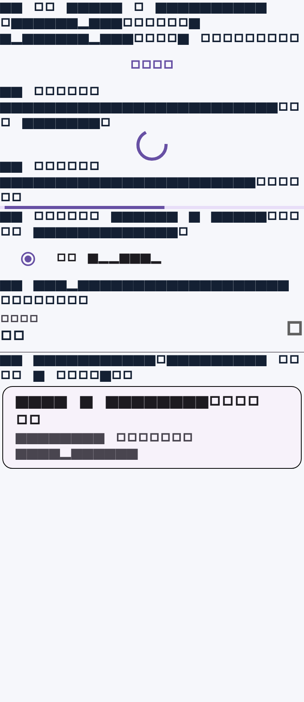

*上图：文字因测试环境未加载中文字体而显示为方块，但**颜色是真实的**。紫色一眼可见。*

在真实页面里也能直接看到——「更新」页的「打开」按钮：

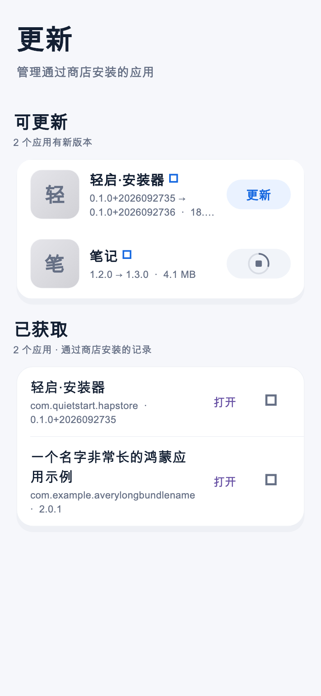

### 受影响清单（22 处，均无 `style:`）

```
main.dart:162,164,166                          重连弹窗：取消安装 / 查看端口 / 连接并继续
view/certificate_manager_sheet.dart:69,72,141  取消 / 确认删除 / 刷新列表
view/components/submit_sheet.dart:184          修改仓库地址
view/detail/app_detail_page.dart:361,664,675,736,853   写评价 / 重试 / 星标 / 展开更新说明
view/pages/mine_page.dart:214,235,271          连接(FilledButton) / 打开无线调试设置 / 打开
view/pages/store_page.dart:134,159,206         登录账号 / 上架图标 / 加载更多
view/pages/updates_page.dart:135,225,236       刷新 / 打开 / 删除
view/setup_guide_page.dart:102                 查看与管理 AGC 证书
```

其中 `mine_page.dart:214` 和 `main.dart:166` 是 **`FilledButton`**，会渲染成**整块紫色实心按钮**，是用户最容易注意到的破绽。

### 修复

`AppColors` 里补一个 `colorScheme`，在 `buildAppTheme` 里替换掉原来那份：

```dart
ThemeData buildAppTheme(AppColors c) {
  final base = c.isDark
      ? ThemeData.dark(useMaterial3: false)   // 兑现注释里的意图
      : ThemeData.light(useMaterial3: false);
  return base.copyWith(
    // ★ 关键：Material 控件的默认色全部来自 colorScheme
    colorScheme: base.colorScheme.copyWith(
      primary: c.accent,
      onPrimary: c.isDark ? const Color(0xFF08111F) : Colors.white,
      secondary: c.accent,
      surface: c.card,
      onSurface: c.text,
      error: c.red,
    ),
    scaffoldBackgroundColor: c.backgroundGrouped,
    // ……其余保持不变
  );
}
```

> 已验证：`ThemeData.light(useMaterial3: false)` 在 Flutter 3.7+ 可用；无论 M2 还是 M3，
> `TextButton` / `FilledButton` / `CircularProgressIndicator` 的默认色都取自 `colorScheme.primary`，
> 所以**设 `colorScheme` 是必须的，光关 M3 不够**。M2/M3 的选择另算（见 P1·组件语言）。

---

## 3. P0 · 令牌相对 `DESIGN.md §6.2` 已经漂移

`DESIGN.md` 第 336-369 行写死了一套 iOS 令牌，`tokens.dart` 里实现的是另一套。这不是"实现比规范新"，而是「iOS 的名字 + Untitled UI / Tailwind 的色值」混合，正是那种说不清的"不够精致"的来源。

### 颜色

| 令牌 | `DESIGN.md §6.2` | `tokens.dart` 实际 | 判定 |
|---|---|---|---|
| light `bgSecondary` | `#F2F2F7` | `#F6F7FB` | 偏离（偏蓝） |
| light `text` | `#000000` | `#142033` | 偏离（蓝黑） |
| light `textSecondary` | `#8E8E93` | `#667085` | 偏离（Tailwind gray-500） |
| light `separator` | `#C6C6C8` | `#E5E9F0` | **明显偏离**，见下 |
| light `blue` | `#007AFF` | `#1769E0` | 偏离 |
| light 「获取」填充 | `#8E8E93` 中性灰 | `#EAF2FF` 蓝调 | **明显偏离**，注释还写着"灰色底" |
| dark `bgSecondary` | `#1C1C1E` | `#101722` | 偏离（偏蓝） |
| dark `card` | `#1C1C1E` | `#1A2431` | 偏离（偏蓝） |
| dark `blue` | `#0A84FF` | `#78ACFF` | 偏离（过亮） |
| `green` `#34C759` | 一致 | ✅ | |
| `AppIconTile` 兜底渐变 | — | `#3A3A3C/#2C2C2E`、`#E5E5EA/#D1D1D6` | **又一套 iOS 灰**，与上面的 Tailwind 灰打架 |

深色模式下这个打架肉眼可见——图标底是暖灰（iOS 系统灰），卡片是冷蓝灰：

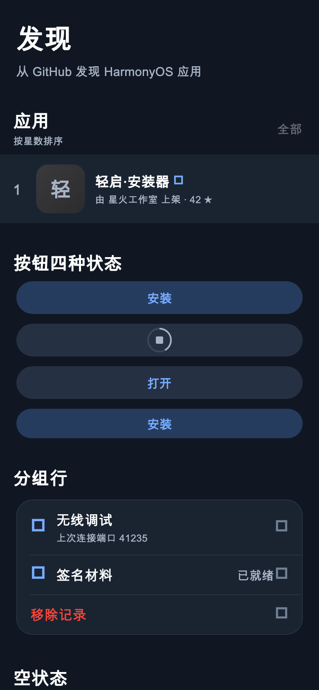

### 圆角

| 令牌 | `DESIGN.md §6.2` | `tokens.dart` |
|---|---|---|
| `card` | **12** | **20** |
| `sheet` | **16** | **28** |
| `button` | 22 | 22 ✅ |
| `icon` | 22.5% | 22.5% ✅ |

另外代码里还散着 **7 个不在刻度上的字面量**：`10`×4（输入框）、`16`×3（详情页安装按钮、评价提交按钮）、`17`（导航选中态）、`15`（搜索框）、`13`（步骤徽章）、`12`（文件图标）、`1.5`（下载方块）。同一个产品里"圆角"有 10 种取值。

### 「获取」按钮填充色的语义

`tokens.dart:87-88` 注释写「按钮填充（「获取」按钮的灰色底）」，值却是 `#EAF2FF`（蓝调）。而 `c.fill` 同时被用在 **5 个语义完全不同**的地方：

- 「获取/安装」按钮底色（`basic.dart:252`）
- 底部导航选中态底色（`home_shell.dart:140`）
- 空状态图标底板（`basic.dart:708`）
- 头像占位底色（`mine_page.dart:87`）
- 禁用态按钮底色（`setup_guide_page.dart:286`）

一个令牌扛五种语义，意味着任何一处的调整都会连带破坏另外四处。

### 修复建议

在 `DESIGN.md` 与代码之间做一次**单向对齐**，二选一：

- **方案 A（推荐）**：承认实现更好看，把 `DESIGN.md §6.2` 更新为当前值，并删掉注释里"灰色底"这类与实现不符的描述；同时补齐 `fill` 的语义拆分：
  ```dart
  fillAction   // 「获取」按钮底
  fillSelected // 导航/分段选中底
  fillDisabled // 禁用底
  fillAvatar   // 头像/图标占位底
  ```
- **方案 B**：回到 `DESIGN.md` 的 iOS 值（`#007AFF`/`#F2F2F7`/`#C6C6C8`/圆角 12），把 `AppIconTile` 的兜底渐变也并入同一套灰。

无论选哪个，**`separator` 都建议往深走一档**：当前 `#E5E9F0` 在白底上只有 **1.22:1**，比 iOS 的 `#C6C6C8`（1.66:1）还淡，加上列表行根本没有分隔线（见 P2），行与行的边界完全消失。

---

## 4. P1 · 双栅格：16 与 20 并存

这是"粗糙"最直观的来源。同一个页面里，**页面标题、分组标题、卡片**三者用了两种水平内边距：

| 元素 | 定义处 | 左边距 |
|---|---|---|
| `PageIntro` 页面标题 | `basic.dart:39` `EdgeInsets.fromLTRB(20, 22, 20, 18)` | **20** |
| `SectionHeader` 分组标题 | `basic.dart:462` `fromLTRB(Space.lg, …)` | **16** |
| `GroupedCard` 默认边距 | `basic.dart:518` `symmetric(horizontal: 20)` | **20** |
| `AppRowCard` 行内边距 | `basic.dart:379` `horizontal: Space.lg` | **16** |
| 「我的」页华为账号卡 | `mine_page.dart:78` `symmetric(horizontal: Space.lg)` | **16** ← 与 GroupedCard 不一致 |
| 「本地安装」页所有卡片 | `offline_install_page.dart:56,70,80` `Space.lg` | **16** |
| 详情页标题卡 / 更新说明卡 | `app_detail_page.dart:455,376` `20` | **20** |
| 详情页底部说明条 | `app_detail_page.dart:785` `Space.lg` | **16** |
| 底部导航栏 | `home_shell.dart:91` `fromLTRB(12, 0, 12, 6)` | **12** |

下面这张图把 20（红）与 16（绿）两条线画出来了，**同一屏上「华为账号」卡和「签名与设备授权」卡左边缘差了 4pt**：

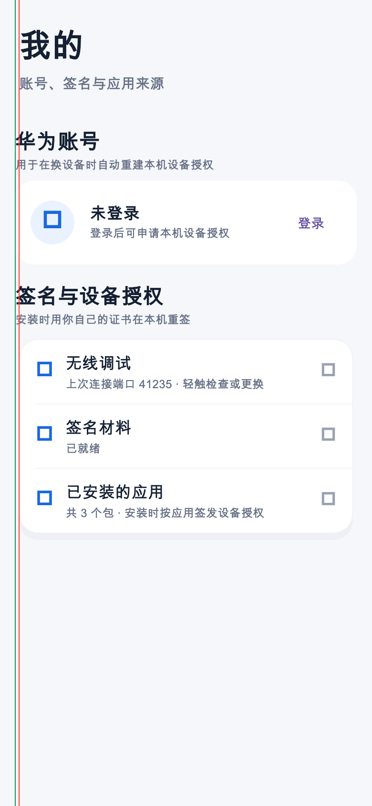

4pt 在物理像素上是 8px（@2x），肉眼是可以看出来的"没对齐"。另外「我的」页里卡片用 `Radii.card`（20）手搓、而不是 `GroupedCard`，所以连阴影和描边也一起丢了——这就是两张卡看起来"不是一家人"的原因。

### 修复

1. `Space` 增加 `pageGutter = 20`，所有页面级水平内边距统一用它。
2. `SectionHeader` 的左边距改成 20（或让 `PageIntro` 改成 16 —— 二选一，全局统一）。
3. `mine_page.dart:78` 的手搓卡片换成 `GroupedCard`。
4. `AppRowCard` 保留 16（行内边距是另一层，属于卡片内部），但要保证它的父级容器也是 20。

---

## 5. P1 · 排版：没有行高，字阶没收敛

`AppText` 的 10 个样式里**没有一个设置 `height`**（`tokens.dart:144-200`）。中文正文的行高由字体度量决定，于是：

- 同一页里，有的文本显式设 `height: 1.45`（`app_detail_page.dart:503,702,849`）、有的 `1.5`、有的 `1.35`、有的 `1.12`（`store_page.dart:357`），有的不设 → **同一屏 5 种行距**。
- `headline`(17/w600) 与 `body`(17/w400) 字号相同，层级只靠字重区分；`caption`(12) 与 `footnote`(13) 只差 1pt，实际不可分辨。

另外 `FontSizes` 里 `title1`(28) 用了 1 次、`title3`(20) 用了 1 次、`caption2`(11) **一次都没用**，且 `AppText` 根本就没有 `caption2` 这个样式。字阶表比实际用到的宽，同时缺了真正需要的层级（比如介于 `title2` 与 `headline` 之间的列表标题）。

### 修复

给每个样式补 `height`，并把字阶收敛到 6 档：

```dart
static TextStyle largeTitle(AppColors c) => TextStyle(
      fontSize: 34, height: 1.18, fontWeight: FontWeight.w700,
      letterSpacing: 0.37, color: c.text);
static TextStyle title2(AppColors c) => TextStyle(
      fontSize: 22, height: 1.27, fontWeight: FontWeight.w700, color: c.text);
static TextStyle headline(AppColors c) => TextStyle(
      fontSize: 17, height: 1.29, fontWeight: FontWeight.w600, color: c.text);
static TextStyle body(AppColors c) => TextStyle(
      fontSize: 17, height: 1.41, color: c.text);          // 中文正文 1.4-1.5
static TextStyle footnote(AppColors c) => TextStyle(
      fontSize: 13, height: 1.38, color: c.textSecondary);
static TextStyle caption(AppColors c) => TextStyle(
      fontSize: 12, height: 1.33, color: c.textSecondary);
```

然后把 `app_detail_page.dart`、`store_page.dart`、`_ReleaseNotes` 里散落的 `copyWith(height: …)` 全部删掉。

---

## 6. P1 · 组件语言不统一

### 6.1 按钮：6 种高度、3 种圆角、4 种实现

| 位置 | 高度 | 圆角 | 实现 |
|---|---|---|---|
| `basic.dart:257` GetButton | 40 / **36**(compact) | 22 | `GestureDetector + AnimatedContainer` |
| `basic.dart:731` EmptyState 操作 | 40 | 22 | `TextButton.styleFrom` |
| `offline_install_page.dart:290` 主按钮 | 46 | 22 | `TextButton.styleFrom` |
| `setup_guide_page.dart:213` 连接 | 46 | 22 | `TextButton.styleFrom` |
| `setup_guide_page.dart:289` 次要操作 | 44 | 22 | `TextButton.styleFrom` |
| `app_detail_page.dart:410` 底部安装 | **52** | **16** | `Material + InkWell` 手搓 |
| `app_detail_page.dart:755` 评价提交 | 50 | **16** | `FilledButton.styleFrom` |
| `main.dart:166` / `mine_page.dart:214` | (默认) | 胶囊 | **未加 style 的 `FilledButton`** |

同一个"主操作"角色有 6 种高度、3 种圆角、4 种实现方式；按下反馈也不一样（`GetButton` 是 `AnimatedScale 0.96`，其余是 Material 水波纹或 M3 的 state layer）。

**建议**：抽出 `AppButton`（`primary` / `secondary` / `destructive` × `md(44)` / `lg(52)`），内部统一走 `TextButton.styleFrom`，圆角统一 `Radii.button`。`GetButton` 保留自己的四态逻辑，但让它复用同一套尺寸常量。

### 6.2 「更新」页把两种行语言塞进同一张卡

`updates_page.dart:204-208`：

```dart
GroupedCard(
  children: [ for (final item in items) _updateRow(item) ],   // -> AppRowCard：60pt 图标 + 无分隔线
),
...
GroupedCard(
  children: [ for (final r in records) GroupedRow(...) ],     // -> 无图标 + 20pt 图标 + 有分隔线
),
```

结果是同一页上「可更新」是"大图标行、无分隔线"，「已获取」是"小图标行、有分隔线"：


还有两个具体问题：
- 第一行的副标题 `0.1.0+2026092735 → 0.1.0+2026092736 · 18.4 MB` 被 `maxLines: 2` 截成 `18....`，**版本号被切掉**。
- 「已获取」行的 trailing 塞了 `TextButton('打开') + IconButton(删除)` ≈ 108pt，长应用名被挤成两行（下图「一个名字非常长的鸿蒙应用示例」）。

**建议**：统一成一种行语言（推荐都用 `AppRowCard` 或都用 `GroupedRow`，图标尺寸二选一）；「已获取」的删除操作收进左滑或长按菜单，trailing 只留一个按钮。

### 6.3 列表没有分隔线

`AppRowCard`（`basic.dart:375-440`）是纯 `InkWell + Container(color: card)`，没有 `Divider`。发现页 4 行连成一块白板：

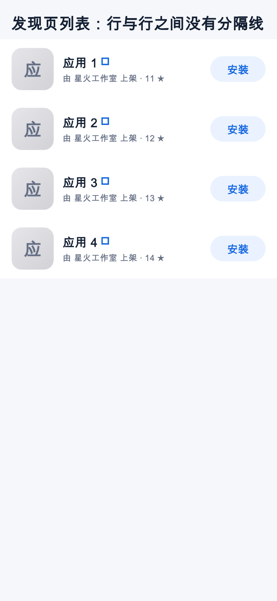

iOS/App Store 的做法是画一条**从文字列开始**（左缩进 76pt）的 hairline。建议在 `AppRowCard` 加 `showDivider`，缩进量 = 行内边距 + 图标宽 + 间距。

### 6.4 `GroupedRow` 的 `value` 与 chevron 之间没有间距

`basic.dart:605-608`：

```dart
if (value != null) Text(value!, style: AppText.subhead(c)),
if (trailing != null) trailing!,
if (onTap != null && trailing == null) Icon(Icons.chevron_right, ...),
```

三个兄弟节点之间没有任何 `SizedBox`。渲染出来就是「已就绪▸」「41235▸」贴在一起：

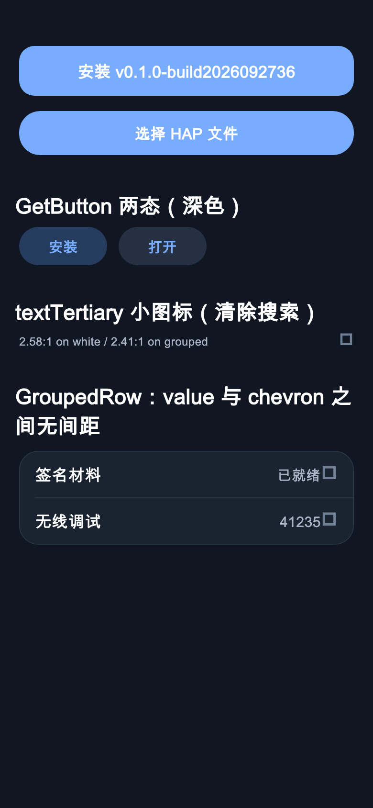

**修复**：`value` 后加 `SizedBox(width: Space.sm)`；`trailing` 前也补一个间距。

---

## 7. P1 · 对比度与深色模式

实测对比度（WCAG 2.1）：

| 用途 | 前景 / 背景 | 比值 | 判定 |
|---|---|---|---|
| 浅色：正文 | `#142033` / `#F6F7FB` | 15.28 | ✅ |
| 浅色：caption / footnote | `#667085` / `#FFFFFF` | 4.97 | ✅ |
| 浅色：**chevron / 清除图标** | `#98A2B3` / `#FFFFFF` | **2.58** | ❌ 低于 3:1（非文本也不达标） |
| 浅色：**「最新」绿字** | `#34C759` / `#FFFFFF` | **2.22** | ❌ |
| 浅色：**破坏性红字** | `#FF3B30` / `#FFFFFF` | **3.55** | ❌ 正常字号需 4.5 |
| 浅色：分隔线 | `#E5E9F0` / `#FFFFFF` | 1.22 | 偏淡 |
| 深色：正文 | `#FFFFFF` / `#101722` | 17.98 | ✅ |
| 深色：caption | `#A8B4C5` / `#1A2431` | 7.46 | ✅ |
| 深色：**主按钮白字** | `#FFFFFF` / `#78ACFF` | **2.30** | ❌ **严重** |
| 深色：textTertiary | `#708096` / `#1A2431` | 3.89 | ⚠️ 小字不达标 |

深色下"白字配浅蓝"出现在 5 个主按钮上（详情页底部安装、离线页大按钮、引导页操作按钮、评价提交、上架确认）：


**修复**：
- `AppColors.dark.accent` 从 `#78ACFF` 收到 `#0A84FF`（iOS 深色 systemBlue），或给按钮用「深色底 + 亮蓝字」而不是「亮蓝底 + 白字」。前者改动最小。
- `textTertiary` 浅色提到 `#8A94A6`（≈3:1）以上；若只用于图标，至少保证 3:1。
- 「最新」绿字改成 `c.text` + 绿色小圆点，或换成更深的绿（`#1F8A3B`）。
- 破坏性红字浅色用 `#D92D20`（4.5:1）。

---

## 8. P2 · 具体页面逐条

### 8.1 `store_page.dart`（发现）
- `:214` 用 `app.stars > 100` 决定是否渲染大卡 —— **数据驱动视觉**。同一个信息流里第 1 行是大图卡、第 2 行是列表行，节奏被打断。建议改成显式的 `featured` 字段（模型里已经有 `featured` 却没被用到）。
- `:171` 搜索框圆角 `15`，与旁边所有卡片的 `20`/`22` 都不一致。
- `:184-185` 清除按钮的命中区就是 `Icon(size: 16)` 本身，**16×16 < 44×44**。包一层 `SizedBox(width: 44, height: 44)` + `IconButton`。
- `:206` 「加载更多」是未加 style 的 `TextButton`（紫色）。

### 8.2 `mine_page.dart`（我的）
- `:78` 手搓卡片，与 `GroupedCard` 不一致（见 §4）。
- `:85-90` `CircleAvatar(foregroundImage: NetworkImage(...))` **没有 `onForegroundImageError`**，头像 404 时会在 debug 下抛异常；而且它绕过了 `ApiClient` 的证书固定（`basic.dart:88-91` 那套 pin）。建议复用 `AppIconTile` 的取图路径。
- `:266` `SizedBox(height: records.length > 5 ? 340 : records.length * 64.0)` —— 用固定行高 64 推算高度，`ListTile(dense: true)` 的真实高度随字号变化，文本缩放时会截断。

### 8.3 `app_detail_page.dart`（详情）
- `:410-416` 底部安装按钮：高度 52、圆角 16、`elevation: 8` + 彩色阴影 —— 是全局唯一的"重阴影"控件，与其它卡片的"hairline + 微阴影"语言冲突。
- `:642` 绿字「最新」对比度 2.22。
- `:531-534` 「安装包」选择行：标签用 `subhead`(15)，**选中的值反而用 `caption`(12)** —— 标签比内容大，层级是反的（iOS 设置行里 label 与 value 同号，或 value 更大）。
- `:435` 按钮文案 `'安装 ${_currentRelease?.tag ?? ""}'`：真实 tag 是 `v0.1.0-build2026092736`，按钮里会出现 24 个字符，窄屏加文本缩放必然省略号截断。建议只显示 `安装` + 版本号单独一行。
- `:369` `padding: EdgeInsets.only(bottom: 124)` 是按"按钮 76pt + 底部安全区 34pt"凑出来的魔数。没有底部安全区的设备（或手势导航被关掉时）会多留约 48pt 空白；而按钮文案换成两行时又会不够。建议改成 `76 + MediaQuery.of(context).padding.bottom + Space.lg`。

### 8.4 `home_shell.dart`（外壳）
- `:107-118` 导航栏固定 `height: 58`，文本缩放 1.5× 时**标签被裁切**：

  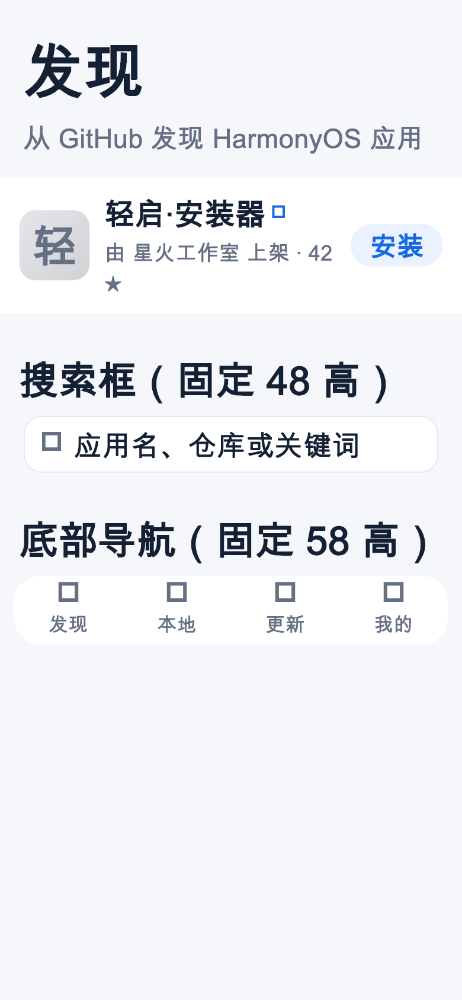

- 浮动圆角导航栏（`margin: fromLTRB(12,0,12,6)` + 圆角 22 + 阴影）本身不是 iOS 范式，且与详情页底部固定按钮（全宽、直角边、圆角 16）是两套语言 —— 详情页打开时视觉上会"打架"。要么都浮动、要么都贴边。

### 8.5 其他
- `main.dart:145-184` 重连弹窗用 `AlertDialog`（Material），而其余半屏面板全是 `showModalBottomSheet` + `Radii.sheet`。同一件事两套容器。
- `certificate_manager_sheet.dart:121-136` 用 Material `Card + ListTile`，没走 `GroupedCard/GroupedRow`，是全局唯一还在用默认 Material 外观的列表。
- `basic.dart:136` `final radius = size * Radii.icon / 100;` —— `icon = 22.5` 是"百分比"语义塞进 `Radii`（圆角刻度）里，混了单位。`AppIconTile` 在 `size: 72` 时半径 16.2，在 `size: 60` 时 13.5，数字本身没错，但令牌命名会误导。
- `basic.dart:161` 兜底图标文字 `size * 0.42`（60pt 图标 → 25pt 字）与 `AppIconTile(size: 74)` 叠加时视觉重量过重。

---

## 9. P2 · 无障碍

`basic.dart:8` 自己写着「所有可点区域 ≥ 44pt（iOS HIG）」，但：

| 位置 | 实际命中区 |
|---|---|
| `basic.dart:257` `GetButton(compact: true)` | **36pt** 高 |
| `store_page.dart:184` 清除搜索 | **16×16** |
| `basic.dart:777` `SegmentedControl` 每段 | **30pt** 高 |
| `app_detail_page.dart:736` 评价星标 `IconButton(size:32)` | 32pt 图标（M3 默认命中区 48，取决于内边距） |

另外：
- `GetButton` 用 `GestureDetector` 而不是 `InkWell`，没有水波纹反馈；`Semantics(button: true)` 包在外面，但没有 `onTap` 语义动作（依赖子节点）。
- `DESIGN.md §6.4` 要求「文本支持系统字号缩放（不使用固定高度截断）」，但代码里固定高度到处都是（见 §8.4）。建议给固定高度的容器换成 `ConstrainedBox(minHeight:)`，或用 `MediaQuery.textScalerOf(context).scale(...)` 参与计算。

---

## 10. 建议的落地顺序

**第一批（半天，收益最大）**
1. `buildAppTheme` 补 `colorScheme`（P0，消灭 22 处紫色）
2. `Space` 加 `pageGutter`，全局统一 16/20（P1）
3. `AppText` 补 `height`，删掉调用点里的 `copyWith(height:)`（P1）
4. `GroupedRow` 补 `value`→chevron 间距（P1，两行代码）

**第二批（一天）**
5. 抽出 `AppButton`，收敛 6 种高度 / 3 种圆角（P1）
6. `AppRowCard` 加 `showDivider`（P1）
7. 「更新」页统一行语言 + 修 `maxLines` 截断（P1）
8. 深色 `accent` 降到 `#0A84FF`，修白字对比度（P1）

**第三批（一天）**
9. 令牌与 `DESIGN.md §6.2` 做一次对齐，更新文档（P0）
10. 触控区补齐到 44pt，固定高度换成 `minHeight`（P2）
11. `mine_page.dart:78` 换 `GroupedCard`；头像走 `AppIconTile` 的取图路径（P2）
12. 详情页底部按钮去掉 `elevation`、圆角并入 `Radii.button`；修 `bottom: 124` 的空白（P2）

---

## 11. 落地记录

### 批次一：让令牌真正贯通

### 改了什么

| # | 问题 | 文件 | 改动 |
|---|---|---|---|
| 1 | 主题未设 `colorScheme`，M3/M2 默认紫泄漏 | [theme/tokens.dart](../app/lib/theme/tokens.dart) | `buildAppTheme` 显式 `useMaterial3: false`；新增 `colorScheme.copyWith(primary/secondary/surface/onSurface/background/error)`；深色 `onPrimary` 用深色前景 |
| 2 | 页面栅格 16 / 20 并存 | [theme/tokens.dart](../app/lib/theme/tokens.dart) | 新增 `Space.pageGutter = 20` |
| 3 | 同上 | [view/components/basic.dart](../app/lib/view/components/basic.dart) | `PageIntro`、`SectionHeader`、`GroupedCard` 外边距、`AppRowCard` 内边距全部改用 `Space.pageGutter` |
| 4 | 同上 | 5 个页面 + 2 个面板 | 全部页面级水平内边距改用 `Space.pageGutter` |
| 5 | 「我的」页手搓卡片 | [view/pages/mine_page.dart](../app/lib/view/pages/mine_page.dart) | 换成 `GroupedCard`，与其余卡片同一套描边/圆角/阴影 |
| 6 | 发现页「最近搜索」裸用 `GroupedRow`（落在 16pt） | [view/pages/store_page.dart](../app/lib/view/pages/store_page.dart) | 包进 `GroupedCard` |
| 7 | 中文行高缺失、调用点补临时值 | [theme/tokens.dart](../app/lib/theme/tokens.dart) | `AppText` 十个样式全部补 `height`；删掉详情页 4 处 `copyWith(height:)` |
| 8 | `GroupedRow` 的 value 与 chevron 贴在一起 | [view/components/basic.dart](../app/lib/view/components/basic.dart) | value 前、trailing 前、chevron 前各补 `Space.sm` |

### 修改前后对照

| 位置 | 修改前 | 修改后 |
|---|---|---|
| 无 style 的 `TextButton` 文字 | `#6750A4` 紫（M3）/ `#6200EE` 紫（M2） | `#1769E0` 应用主色 |
| `CircularProgressIndicator` / `LinearProgressIndicator` | 同上，紫 | 应用主色 |
| `RadioListTile` 选中、`FilledButton` 填充 | 紫 | 应用主色 |
| `Card` 底色 | `#FEF7FF` 淡紫白 | `#FFFFFF` |
| 深色 `FilledButton` 文字 | 白字压 `#78ACFF`，**2.3:1** | 深色字压亮蓝，**≥ 4.5:1** |
| 「我的」页两张卡片左边缘 | 20 / 16，差 4pt | 都在 20 |
| 「已就绪」与右箭头 | 0 间距，贴在一起 | 8pt |

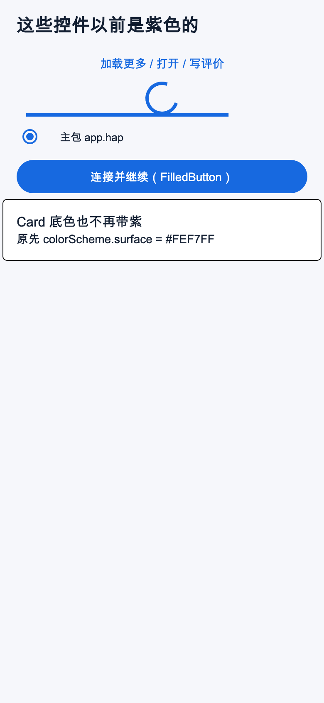
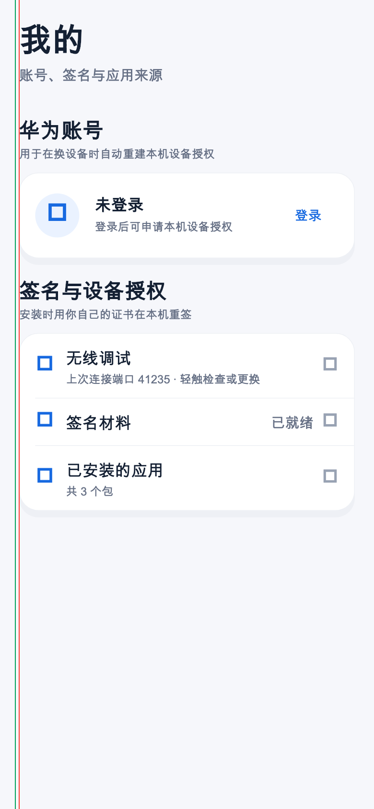

*栅格图里红色 = 20pt，绿色 = 16pt。修改前「华为账号」卡片落在绿线上，现在两张卡都落在红线上，绿线上不再有任何东西。*

其余对照图：[发现页](design-review/after/after-gallery-light.png)、[深色](design-review/after/after-dark.png)、[更新页](design-review/after/after-updates.png)、[文本缩放 1.5×](design-review/after/after-text-scale-1.5.png)。

### 顺带加上的回归测试

[app/test/design_tokens_test.dart](../app/test/design_tokens_test.dart)（10 项）把这些约定钉住，避免被无意改回去：

- 主题必须显式关闭 M3，且 `colorScheme` 跟随主色（浅/深）
- 主色按钮前景/背景对比度 ≥ 4.5:1
- **未加 `style` 的 `TextButton` 实际绘制色必须是主色**（直接读 `RenderParagraph`，能真正抓到"又变紫了"）
- 页面标题 / 分组标题 / 卡片可见边缘 / 通栏行图标都落在 `Space.pageGutter`
- 卡片内部是第二层（栅格 + `Space.lg`）
- `GroupedRow` 的 value 与 chevron 间距 ≥ `Space.sm`
- `AppText` 每个样式都带 `height`，且字阶单调

验证方式（用真机同一套工具链）：

```bash
export PATH="$HOME/Documents/harness_workspace/orbit-admin/.toolchains/flutter-ohos-3.7.12-retry/bin:$PATH"
cd app
flutter analyze lib/ test/     # No issues found!
flutter test                   # 72 项通过（原 62 + 新增 10）
```

### 工具链的两个坑（会误导后续验证）

1. **`flutter-ohos-3.7.12` 的 `flutter test` 关掉了 asserts**，导致 `RenderObject.debugLayer`
   恒为 `null`，`matchesGoldenFile` 必然抛 `Null check operator used on a null value`。
   **金标截图必须用官方 Flutter 跑**；但因为主题已显式 `useMaterial3: false`，
   官方工具链渲染出来的控件形状与真机一致，图仍然可信。
2. 3.7 的测试窗口 API 是 `tester.binding.window.physicalSizeTestValue`，
   不是 3.9+ 的 `tester.view.physicalSize`。写跨版本测试时注意。

### 批次二 / 三：组件语言收敛与无障碍

| # | 问题 | 改动 |
|---|---|---|
| 9 | 填充按钮 6 种高度 / 3 种圆角 / 4 种实现 | 新增 `AppButton`（`primary` / `secondary` / `destructive` × `Sizes.buttonMd` / `buttonLg`），圆角统一 `Radii.button`；`setup_guide` / `offline_install` / `app_detail` / `submit_sheet` / `mine_page` / `certificate_manager` 全部换过去 |
| 10 | 列表行没有分隔线 | `AppRowCard` 加 `showDivider`，缩进到文字列（`pageGutter + rowIcon + md`）；版本历史行也补上 |
| 11 | `GetButton` 两态几乎一样（底色反差 1.02:1） | 已安装态改成**透明底 + 主色描边纯文字**，可安装态是中性灰药丸——形状差异取代色差 |
| 12 | 「获取」按钮底是主色淡染，注释却写"灰色底" | 新增 `fillAction`（浅色 `#F0F3F8` / 深色 `#28313F`），中性 |
| 13 | 一个 `c.fill` 扛 5 种语义 | 拆成 `fillAction` / `fillSelected` / `fillDisabled` / `fillPlaceholder` / `fillSecondary` |
| 14 | 深色主按钮白字压亮蓝 2.3:1 | 新增 `onAccent`（深色下 `#08111F`），`FilledButton` 与 `AppButton` 都用它 |
| 15 | `green` / `red` 当文字只有 2.2 / 3.5:1 | 新增 `greenText` / `redText`（浅色 `#11763A` / `#C0271C`），图标仍用原色 |
| 16 | `textTertiary` 2.58:1，用作清除按钮 | 提到 `#828C9E`（卡片 3.39:1、分组底 3.17:1）；清除按钮同时改成 `textSecondary` |
| 17 | `separator` 1.22:1，比 iOS 还淡 | 提到 `#D0D7E2`（1.45:1） |
| 18 | 更新页两种行语言混用、版本号被截成 `18....` | 「已获取」改用 `AppRowCard`；副标题只留版本跃迁；删除操作移到长按（副标题注明） |
| 19 | 「已获取」trailing 两个按钮把标题挤成两行 | trailing 只留「打开」，删除进长按确认面板 |
| 20 | 清除搜索按钮命中区 16×16 | 包到 `Space.touch`（44×44） |
| 21 | `GetButton(compact)` 只有 36 高 | 视觉 34，命中区包到 44 |
| 22 | `SegmentedControl` 30 高 | 32（iOS 原生轨道高，平台约定）+ `minHeight`；文档里注明这是唯一例外 |
| 23 | 固定高度导致文本放大被裁切 | 搜索框 48、底部导航 58、详情页按钮 52、已安装列表 `行数×64` 全部改 `minHeight` / `maxHeight` |
| 24 | 头像用裸 `NetworkImage`（绕过证书固定、无失败兜底） | 新增 `NetworkAvatar`，复用 `AppIconTile.fetchBytes` |
| 25 | 发现页用 `stars > 100` 决定大卡，一屏可能连出多张 | 改为**至多一张**：优先 `featured`，否则星数最高的一张 |
| 26 | 详情页底部按钮圆角 16、`elevation: 8` 重阴影 | 换 `AppButton(buttonLg)`，去掉阴影 |
| 27 | 详情页底部留白写死 124 | 改成 `buttonLg + lg + xl + 安全区` |
| 28 | 详情页「安装包」标签 15 / 值 12，层级反了 | 标签 17 / 值 15 |
| 29 | 重连弹窗、证书删除确认用 Material `AlertDialog` | 统一改半屏浮层 + `AppButton` |
| 30 | 证书面板用 Material `Card + ListTile` | 改 `GroupedCard` / `GroupedRow`，与全站一致 |
| 31 | `Radii.icon = 22.5` 把百分比塞进圆角刻度 | 改名 `Radii.iconCornerPercent`；刻度收敛为 `field 12 / card 20 / button 22 / sheet 28`，刻度外字面量清零 |
| 32 | 图标兜底字母 `size × 0.42` 视觉过重 | 降到 `0.34` |
| 33 | 纯文字动作（打开/加载更多/重试）各自为政，命中区不一 | 新增 `AppTextButton`，9 处替换 |
| 34 | `visualDensity` 跟随平台，控件高度漂移 8pt | `buildAppTheme` 锁死 `VisualDensity.standard` |
| 35 | `DESIGN.md §6.2` 与实际实现漂移 | 重写为「以 `tokens.dart` 为唯一真源」+ 6 条有测试守住的硬约束 |

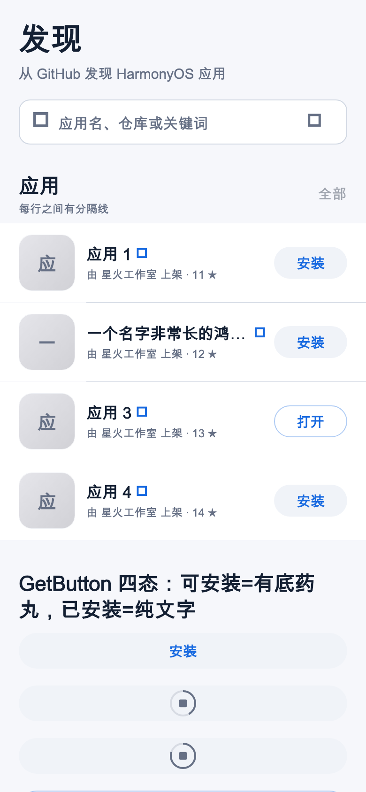
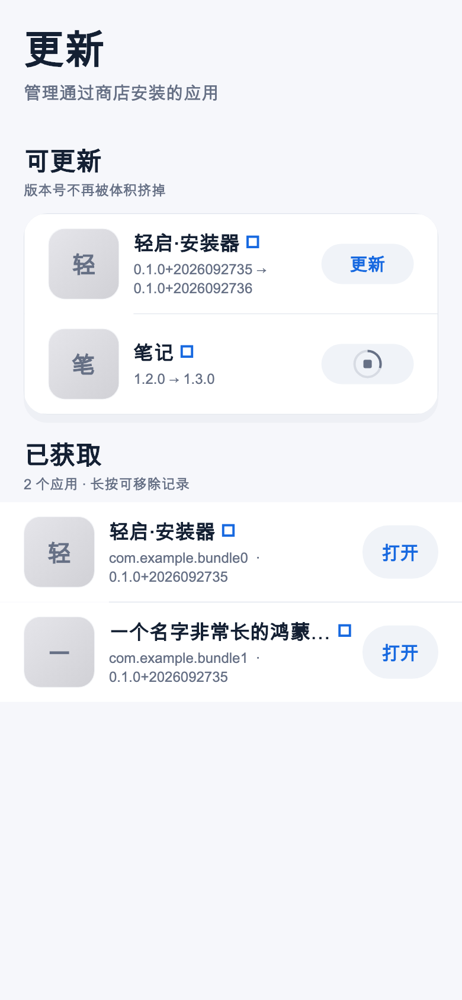

*发现页：行分隔线、四态按钮（安装=灰药丸 / 打开=描边纯文字）、长名称正确省略。*
*更新页：两个分组共用同一套行语言，版本号完整显示。*

其余：[我的](design-review/final/final-mine-gutters.png)、[深色](design-review/final/final-dark.png)、[文本缩放 1.5×](design-review/final/final-text-scale-1.5.png)。

### 过程中被测试抓到的两个真问题

**1. `AppButton` 会撑满整屏高。** 最初写成 `Center(widthFactor: 1, child: content)`——
`Center` 不写 `heightFactor` 时会撑满父级可用高度。放在 `ListView`（高度无界）里看不出问题，
一旦放进有界高度的容器按钮就会变成整屏高。新增的尺寸断言
（`expect(getSize(AppButton).height, 44)`）当场抓到，已修为
`Center(widthFactor: 1, heightFactor: 1)`。

**2. `AppButton` 的文字被顶到左上角（用户报的）。**
`Stack` 的默认 `alignment` 是 `topStart`，而它的**非定位子节点是 shrink-wrap 的**——
于是内容缩成一团贴在左上角，外层 `ConstrainedBox` 撑出来的宽高全浪费掉。
只有 `expand: false` 且内容恰好撑满时才看不出来。已改为 `Stack(alignment: Alignment.center)`。

> 这个 bug 我自己的测试没抓到：原来的尺寸断言只量了 `AppButton` 的**外框**（44 / 52 都对），
> 没有量内容相对外框的位置。补了两条断言直接比较 `getCenter(文字)` 与 `getCenter(按钮)`，
> 并要求偏差 ≤ 0.5pt，覆盖 `expand` × 两档尺寸 × 带图标四种组合。

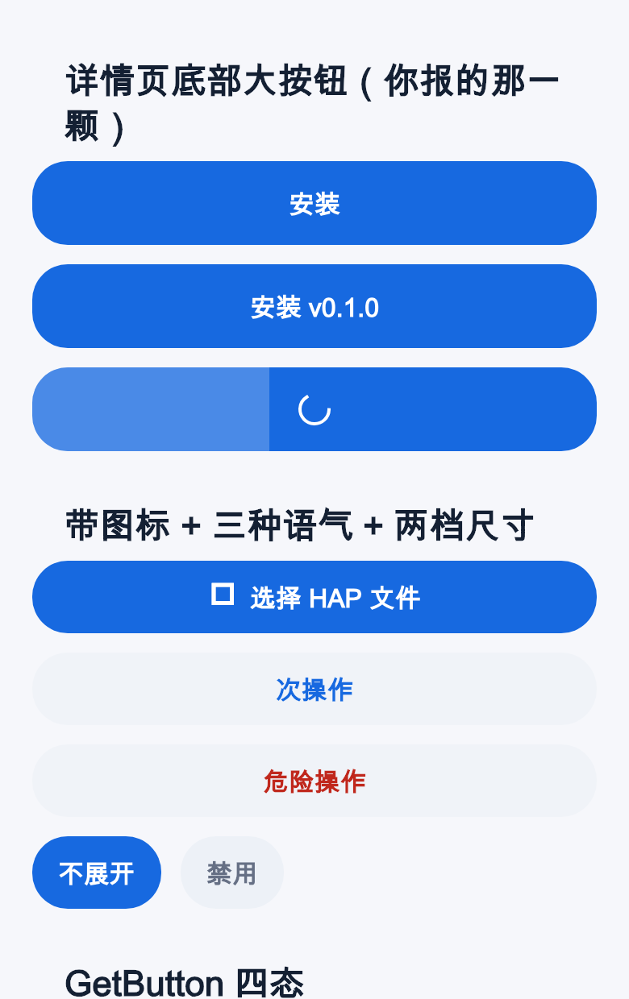

**3. 控件高度随平台漂移 8pt。** `AppTextButton` 断言 44 却量到 36。追下去是
`ThemeData.visualDensity` 默认取 `VisualDensity.adaptivePlatformDensity`，
而它在 **macOS/Linux/Windows 上是 `compact`**，会把 Material 控件的 `minimumSize`
减 8pt；移动端是 `standard` 所以真机看不出来。结果是"同一份代码在开发机和真机上
按钮高度不同"。已在 `buildAppTheme` 里锁死 `VisualDensity.standard`，并加断言守住。

> 顺带发现：鸿蒙分支 Flutter 3.7.12 的 `_RenderInputPadding._computeSize` 里
> `height`/`width` 两个局部变量名与取值是反的（`height = max(childSize.width, minSize.width)`）。
> 因为 `Size(height, width)` 又把顺序换了回来，行为恰好正确——但读代码时极易误判，
> 排查这个问题时多花了不少时间。

### 剩余（本轮有意不做）

- **`AppIconTile` 的内存缓存** 是 `Map` + 200 条上限的粗暴实现，没有淘汰策略；量大时应换 LRU 或
  `cached_network_image`。当前不构成问题。
- **`store_page` 的精选卡**仍是「深蓝渐变 + 白色大标题」的独立视觉语言，与全局扁平风格不同源。
  它是刻意的编辑位，保持现状。
- **`certificate_manager_sheet` 的固定高度** `MediaQuery.height * 0.62` 在超大字下仍可能偏紧。
- 上述三条都不影响信息完整性，留待有实际反馈再动。

---

## 附录 A · 如何复现证据

本目录的图由真实组件渲染，不是手绘示意。复现方式：

```bash
cd app
# 1) 临时放一个 golden 测试，用 390x844@2x 渲染组件
#    （字体用 /System/Library/Fonts/Supplemental/Arial Unicode.ttf，
#      通过 FontLoader 注册并写进 theme.textTheme.fontFamily）
flutter test test/_design_probe_test.dart --update-goldens
```

两点必须注意，否则会误判：

- **`flutter test` 会关闭阴影模糊**（`debugDisableShadows`），带 `elevation` 的控件会被画成**黑色硬边**（见 `design-review/detail-bottom-bar.png` 底部按钮的粗黑框）。这是测试环境产物，**不是真机效果**。
- 测试环境没有 Material 图标字体，所有 `Icon` 渲染成方块。颜色、间距、字号、换行、截断是真实的；图标形状不是。

## 附录 B · 本次用到的 OpenDesign 设计准则

审查时参照了 OpenDesign 仓库里 `craft/` 的这几篇（`typography-hierarchy.md`、`color.md`、`accessibility-baseline.md`、`state-coverage.md`、`anti-ai-slop.md`），其中直接命中本项目的是：

- **`state-coverage.md`**：「同一个控件的每个状态必须有可分辨的视觉差」。本项目的「安装」与「打开」底色对比度只有 **1.02:1（浅色）/ 1.18:1（深色）**，属于典型的状态覆盖不足。
- **`color.md`**：「一个语义一个令牌」。本项目 `c.fill` 扛了 5 种语义。
- **`accessibility-baseline.md`**：44pt 命中区、4.5:1 正文对比度、文本缩放不截断 —— 三条都没完全达标。
