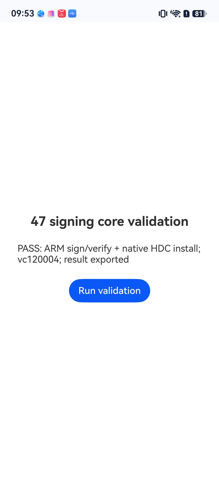

# 47 内外包重签验证（2026-09-30）

## 修复

- 轻启的外包签名有效，不代表内嵌工作模块获得了当前设备授权。签名前分别处理两层，更新工作模块清单的大小与 SHA-256，最后验证两层的签名证书、完整 Profile 必须一致。
- 同一私钥对应的续期证书可能与 Profile 内指定的证书具有不同 DER。系统不接受这种组合。签名器现在从已验签的 Profile 取出指定证书，核对私钥、公钥、有效期和下载证书的颁发链后使用它，不另外申请证书。
- 申请设备授权前合并外包、工作模块的权限。缓存 Profile 缺少所需 ACL、设备或正确签名材料时不复用。
- 恢复任务也检查内包授权和 Profile 中的实际签名证书，拒绝旧版留下的错误签名缓存。
- 本地重新导入同版本轻启时执行修复安装，不以“外包版本已安装”跳过签名、提交安装；修复失败不能用旧版本号掩盖。
- HDC 对安装失败的文字结果进行判断，避免错误响应被当成安装成功。

## 实机证据

设备：HarmonyOS 6.1 / API 24。

1. 从公开的轻启 1.2.0 提取原工作模块，直接安装复现 `9568423`，旧 Profile 不包含此设备。
2. 用同私钥的另一张证书配合旧 Profile，虽然通用 SDK 验签通过，设备仍返回 `9568322`。换成 Profile 中的确切证书后进入权限校验；缺少后台 ACL 的 Profile 返回 `9568289`。
3. 使用已取得的有效 AGC Profile（包含本机和 `KEEP_BACKGROUND_RUNNING_SYSTEM`），在手机内运行与发布 47 **字节完全相同**的 ARM 原生库。输入外包和内包均未签名，手机完成分层重签、完整验签，通过应用内原生 HDC 覆盖安装并确认 `versionCode=120004`。
4. 导出手机实际生成的 HAP。官方 SDK `verify-app` 对外包和内包均通过；两层 Profile 字节与授权 Profile 完全一致；内包清单的版本、大小、摘要匹配。
5. 手机生成的内包独立覆盖安装成功，主包和工作模块均保留。测试没有卸载轻启，客户端正常页面已恢复，临时测试材料和导出脚本已清理。
6. 管理页取消两条测试安装任务，分区数量依次从 2 变为 1，最后“正在安装”分区隐藏；保留已安装应用和上架列表。

测试只临时提高轻启包内版本号，应用程序内容来自公开 1.2.0 制品。本次确认的是实际手机签名、授权校验、传输与两层安装；使用已有有效 Profile，未把当前账号的新建 AGC Profile 流程算作通过。当前账号调用新建授权曾返回 `cert not exist`，需单独核对账号下证书记录，不能由这次签名测试证明已解决。

按用户最新要求停止 46→47 迁移测试，不发布 48/78 预览版。已经装过同版本轻启且工作模块导入失败的用户，可在 47 中本地重新导入轻启 HAP 触发修复。

## 制品及回归

- 制品：`quietstart-installer-0.4.47-unsigned.hap`，正式包名，`versionCode=2026093013`。
- SHA-256：`06a64792becd468bc44042a73a3f24f05ced79b6d96d604efd1e16073041fa2f`。
- ARM 核心 SHA-256：`e880daff860f0c635f4ea94f7d99f9cb994d73a8a36acba256c91b78875329dc`。
- 递归无签名检查通过；发布安装器内不含内嵌 HAP、调试 Profile、证书或私钥。需要由侧载工具用用户自己的身份签名后安装。
- ArkTS 服务回归 158 项、Rust 签名核心 8 项、HDC 安装结果专项、HAP 核心 17 项、无签名制品检查 3 项、服务端 52 项通过。

验证脚本位于临时私有工作区，含实机测试材料，未进入源码仓库或发布制品。
