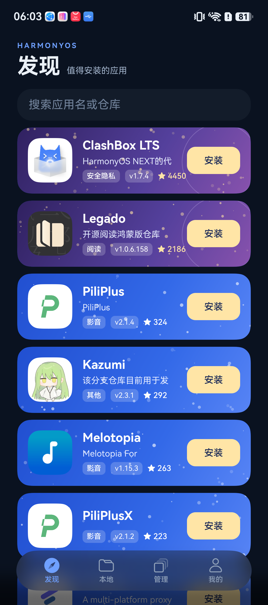
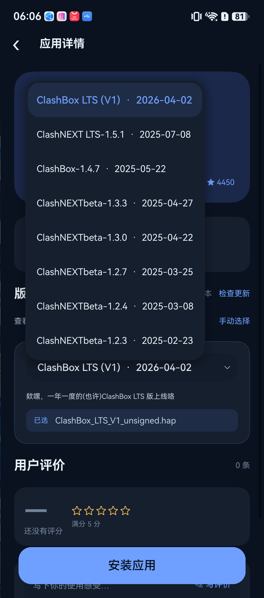
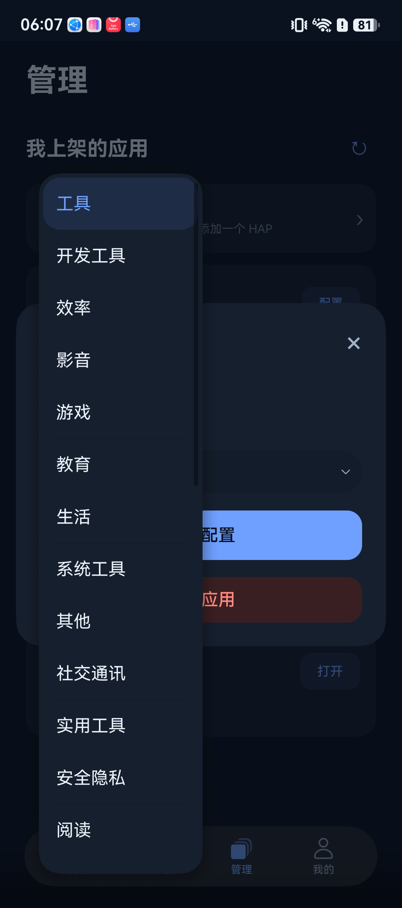
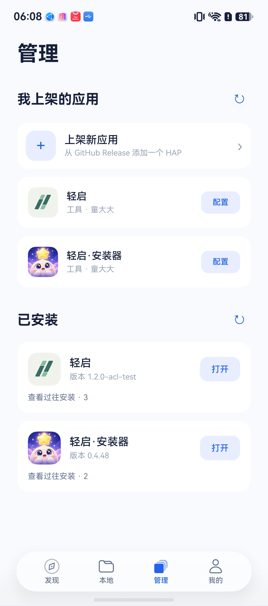

# 0.4.48 深色模式与首轮应用识别

版本名仍为 `0.4.48`，公开替换制品构建码 `2026100101`，正式包名 `com.tonghongxiang.hapstore`。

## 深色模式

- 页面通过读取自身主题状态的 `colors()` 方法取色，避免修改静态标记后颜色使用点没有触发刷新。
- 导航图标和文字显式设置选中与未选中颜色，保留官方 HdsTabs 沉浸材质。
- 上架分类、应用配置分类、详情历史版本的选择框补全选项、选中项、箭头及弹出菜单颜色；关闭菜单的默认背景模糊，消除深色菜单的白色框和缝隙。
- 连接按钮补充前景色；从系统设置返回时同步主题；图标取色异步结果按请求时的主题核对，过期结果不能覆盖当前主题。

实机发现颜色访问器在 ArkUI 组件生成结果中的兼容问题导致启动失败，已改为普通方法，并重新构建、安装及验证后发布。

## 首次识别

- 系统能查询包信息时直接读取，避免强制用户连接调试。返回无效或零版本信息时保持未知，仅明确“包不存在”才判定未装。
- 系统查询不可用、无完整识别快照且存在未知应用时，首次提供可关闭的无线调试识别窗口；发现页保留“识别”入口。
- 连接后根据完整商店目录读取设备状态，更新发现与管理页面，并缓存确认安装的版本和启动入口；完成标记单独持久化。
- 已有有效快照或用户跳过本轮提示后，不自动反复弹窗；断连或查询失败保留已知状态。
- 扫描中到达的新目录请求合并排队，避免首屏扫描吞掉后续应用。
- 连接后先核对应用状态，再继续原有安装。相同在线版本已安装时可认领旧任务；本地导入的同版本修复安装不能被此扫描跳过。

缓存只能保留已确认的状态，无法在系统查询受限且无线调试断开时发现新发生的外部安装或卸载；此时可以手动连接重新识别。

## 验证

- 客户端 170 项测试通过，包含首轮提示与跳过、快照恢复、失败保留状态、并发目录扫描、系统零版本降级、主题隔离和过期异步取色。
- ArkTS 33 个构建任务全量通过，外包及内嵌包递归无签名检查通过。
- HarmonyOS 6.1 设备 `3BH0224320005595` 使用已有设备签名材料，经官方签名工具及 `verify-app` 验证后覆盖安装成功，无新证书申请、无卸载。
- 深色导航和发现页面、版本弹出菜单、配置分类菜单已实机查看。切回浅色前后应用进程 PID 均为 `15071`，界面颜色刷新正确。
- 发现页搜索“轻启”，轻启和安装器均显示“打开”；管理页安装器显示 `版本 0.4.48` 和“打开”。清理了上一轮验证留下的暂停任务。
- 设备已有登录和安装数据，没有清空沙箱。全新用户首次登录至连接识别的完整流程尚未实机覆盖；相应分支以生产方法的模拟测试验证。
- 本轮未执行应用内自更新或多应用队列安装验收。

## 实机截图

