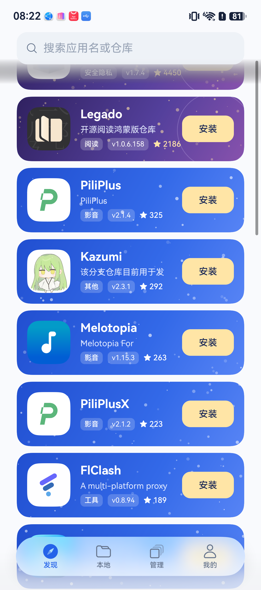
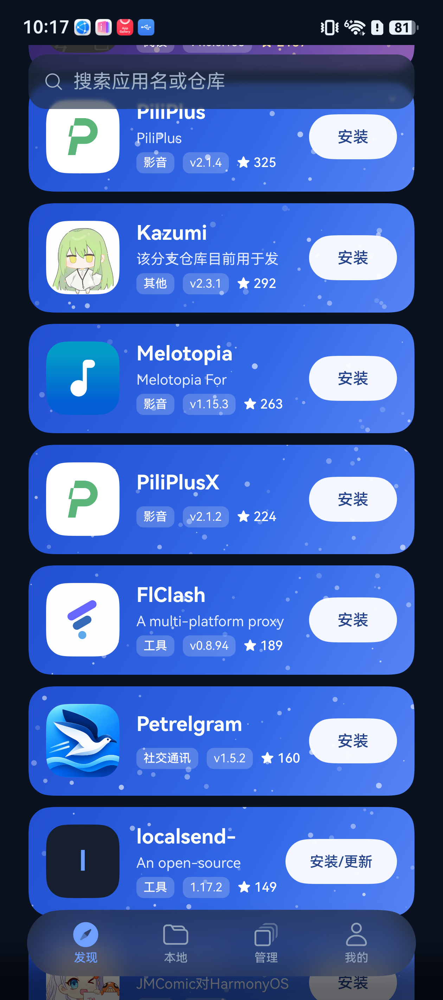
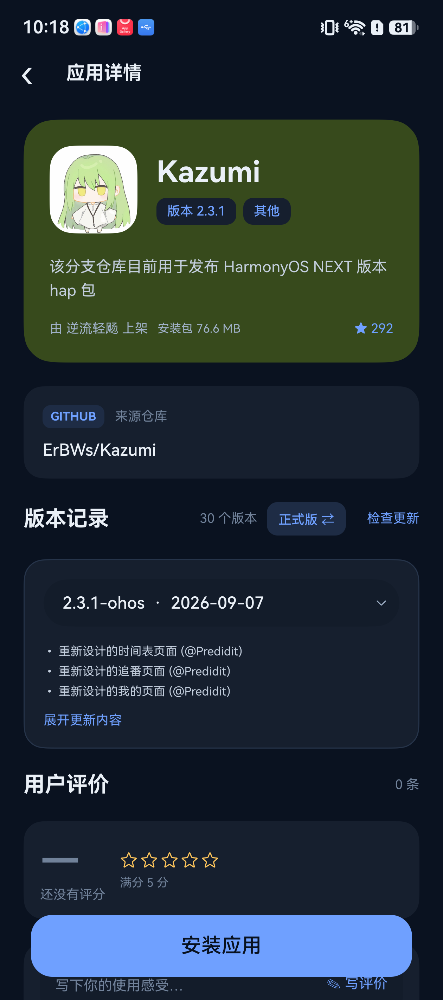
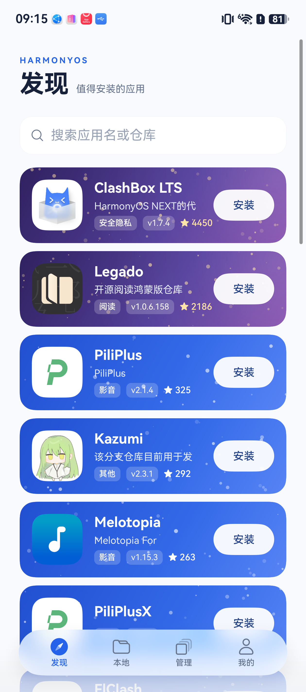
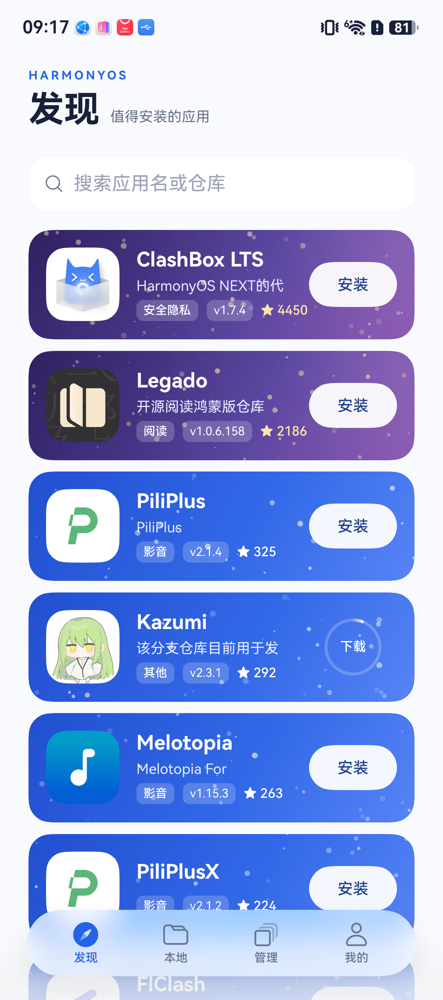
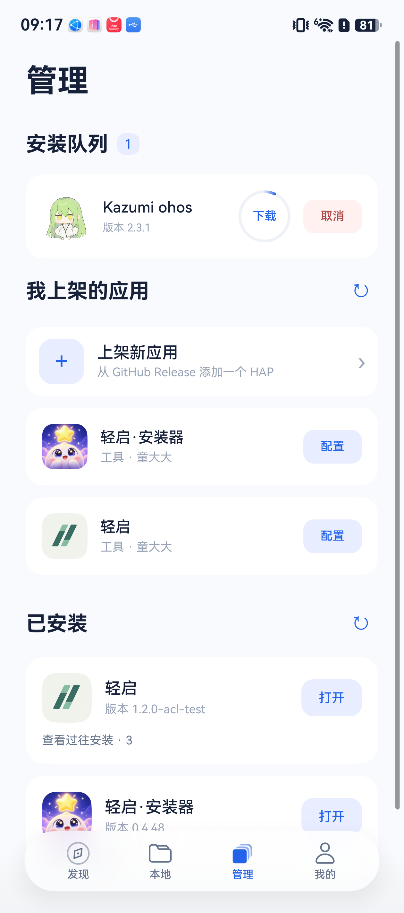
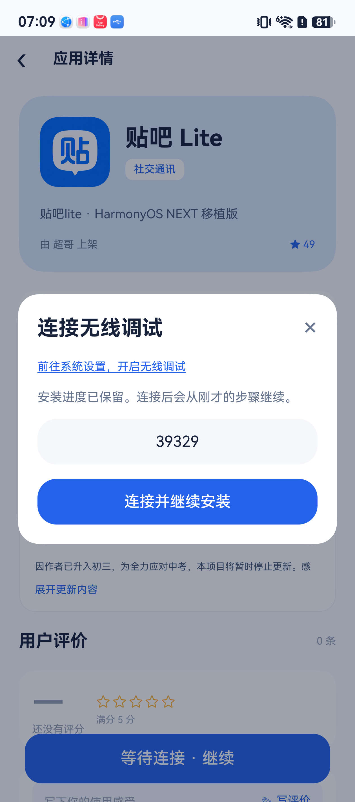
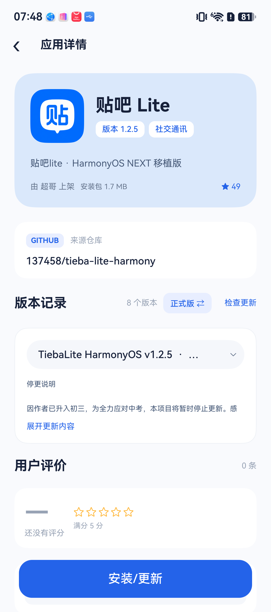
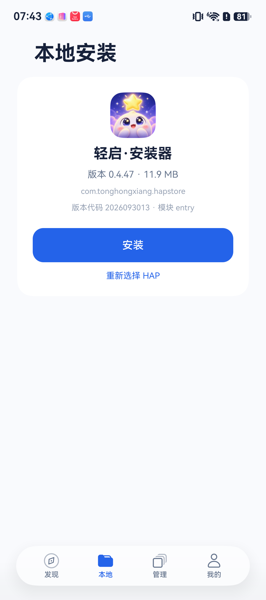

# 0.4.48 刷新、进度与连接弹窗

正式包名 `com.tonghongxiang.hapstore`，版本名 `0.4.48`，替换构建码 `2026100107`。

## 最新替换制品

- 2026-10-01 重新执行干净构建，33 项任务全部执行，222 项客户端测试与 3 项无签名校验测试通过。
- 制品为 quietstart-installer-0.4.48-unsigned.hap，12649218 字节，正式包名、versionCode 2026100107、versionName 0.4.48。
- SHA-256：5e8f0bfbabe867d31d77e36960313a0c44b2240dabd18043492dc8b9007948f0。
- 递归检查确认公开制品没有签名；本轮 HAP 没有内嵌 HAP。本轮重新构建没有额外执行真机安装，实机范围以本文已有记录为准。

## 发现页

- 下拉刷新仅等待目录元数据，不等待图标下载、设备扫描或管理页更新列表；不触发服务端 GitHub 采集。
- 相同图标请求复用正在执行的下载，旧搜索或旧图标修订结果不能覆盖新列表。
- 设备扫描合并重复包名；批量扫描只核对一次连接，不为每个应用重复读取 UDID。
- 发现页和管理页进行中的任务共用 48vp 无底色圆环，中央固定两字表示阶段；下载和传包按真实字节填充，签名和系统安装显示旋转圆环，暂停和排队保留静态轨道；星光卡操作按钮改为浅色胶囊，去掉黄色块。真实计数和顺序队列保持不变。
- 千星和万星卡移除右侧描边圆环，改为柔和渐变光晕，保留分级色调与星点。
- 普通卡、星光卡的实际图标和占位图标均可点击进入详情，安装按钮保持独立。
- 大标题随列表滚出，搜索框使用原生列表吸顶。搜索框与底部导航使用相同的 HdsTabs 原生 IMMERSIVE / ADAPTIVE 浮动栏材质，随深浅色切换；不再叠加 HdsNavigation 标题栏渐变或额外底色；移除整条背景、离屏蒙版及渐变遮罩。

## 透明状态栏

- 窗口启用全屏布局，顶部状态栏和底部系统导航栏都设为透明；HDS 浮动导航也取消栏外默认渐变遮罩，页面底色延伸到屏幕边缘；系统文字随主题切换对比色。
- 从窗口读取系统与摄像头避让区，按当前屏幕密度换算安全间距。标题、吸顶搜索和详情返回栏避开状态栏；旋转和窗口变化会重新读取。
- 安全区读取不依赖尚未加载的 UIContext；新增 3 项生命周期测试覆盖启动、密度与避让变化、窗口暂态和主题切换。

## 安装进度

- 下载按实际接收字节、传包按 Rust HDC 成功写出的字节显示当前阶段百分比。
- 原生进度观察不进入 HDC 命令队列，每 150 毫秒读取一次，结束或失败时停止轮询。
- 签名、等待设备、系统安装及结果核对没有可靠分母，显示活动动画和阶段用时，取消固定 75%／95% 等估算值。
- 详情按钮改用原生 Capsule Progress 平滑追随真实字节进度；授权、签名与系统安装使用原生属性动画驱动 2vp 底边流光，文字与主体保持稳定，采用 1800ms 缓动往返，不显示按钮内转圈，取消自绘 Canvas 扫光色块与 33ms 定时器；发现、详情和管理继续订阅同一任务快照。迟到的进度不能恢复已取消或已完成任务。
- 传包 100% 只表示包已传送。最终完成仍要求系统安装成功和设备版本核对通过，不能把传包进度当作系统安装百分比。

## 详情与连接

- 应用名保持原字号，名称下方并排显示版本和分类；安装包大小接在上架人后面，节省一行。未知大小不借用其他版本数据。
- 历史版本统一用下拉框选择，在「版本记录」标题右侧用「正式版／预览版」按钮切换是否允许选择预览版。更多历史版本入口放进下拉框，删除内容下方独立的加载行；单附件不再显示冗余的已选附件行。
- 无线调试请求由当前可见页面展示，导航间隙仍保留请求；连接后继续原任务，关闭后返回旧页面不会再出现旧弹窗。
- 两处端口输入均居中，初次打开自动回填上次成功端口，异步回填不能覆盖正在输入的内容。
- 系统设置入口改为标题下方的小号下划线链接，删除「可以关闭此窗口」及之后的识别说明。
- 根据原生错误区分端口不接受连接、明确占用、信任拒绝和超时。普通超时或断流不能直接认定端口被占。

## 本地 HAP 预览

- 选择文件只复制到应用缓存并读取图标、包名、版本、模块和文件大小，不保存任务、不申请 Profile、不签名或安装。
- 主按钮由「选择 HAP 文件」变为「安装」，提供次要的重新选择入口。预览可以保留到其他 tab 返回；换文件或销毁页面时清理预览文件。
- 点击安装后再次核对缓存内容，提升为工作文件并保存任务，进入现有顺序队列；本地 HAP 不执行网络下载步骤。

## 验证与范围

- 客户端 222 项测试通过，覆盖后台刷新、重复请求合并、过期结果隔离、真实进度、阶段保留、导航弹窗归属、回填竞态、版本和大小展示、本地预览不建任务、确认后入队、取消清理、文件变化拒绝及本地队列跳过网络下载。
- Rust HDC 9 项测试通过，包含传包字节观察与路径隔离。
- ArkTS 全量 33／33 构建任务通过，递归无签名检查通过。本产物仅一个 HAP，没有内嵌 HAP。
- HarmonyOS 6.1 设备 `3BH0224320005595` 使用已有材料，经官方签名及 `verify-app` 后覆盖安装；公开制品仍为无签名包。
- 实机检查发现页标题滚出和吸顶搜索；2026100105 确认仅搜索框悬浮，无整条背景及黑色阴影，千星卡右侧无描边圆环；点击星光卡 Legado 和普通卡轻启·安装器的图标均进入对应详情。无线调试关闭时，在 Index 启动的任务进入详情后，连接窗口出现在详情层，等待任务保留。两处输入居中，成功端口回填，设置入口可打开系统无线调试页面。系统文件选择器选择无签名 47 HAP 后，显示实际 0.4.47、版本代码、模块与大小，按钮变为「安装」，无自动安装。
- 2026100105 真机点击 Kazumi 安装，发现与管理同步显示 48vp 圆环及中央「下载」，其他应用安装按钮保持可点击；管理页暂停态显示「暂停」。千星卡右侧描边消失，悬浮搜索框周围没有背景遮罩。
- 2026100106 经官方 SDK 签名与验签后覆盖安装；浅色和深色实机确认原生光感搜索框、透明状态栏，以及吸顶搜索与详情返回栏的安全间距，主题切换无需重启。启动早于 UIContent 的安全区回调已通过实机及生命周期回归验证。
- 本轮未完成新的端到端签名安装及传包进度录像：设备已有账号申请目标 Profile 时返回 `cert not exist`，因此没有为页面验证删除或重新申请账号证书。相关传输逻辑通过原生测试及真实构建验证，不能据此声称整个安装流程已实机验收。
- 实机暂停测试任务已取消清理，系统无线调试恢复开启；未卸载应用或清空账号数据。

## 页面证据

## 授权和安装等待优化

- 一次成功的 UDID 请求复用该次实时查询结果，不再紧接着重复查询；断连仍会重新核验并尝试已保存端口。
- AGC 设备登记仅在 Profile 成功签发并完整核验后缓存 10 分钟；账号、团队和完整 UDID 隔离。设备记录变化后重新读取，ID 确实变化才重试签发；证书或权限错误不重复申请。
- 现有 Profile 继续检查包名、UDID、证书、权限和有效期，不减少安全校验。
- 安装确认按 250、500、1000、1500ms 逐步退避，总等待上限仍为 15 秒，等待期间不重复安装。
- 新增 12 项有状态回归测试，覆盖断连、缓存隔离、登记失效、权限缺失和确认超时；207 项客户端测试全部通过。这里的 250ms 是轮询间隔，并非宣称实机安装只需 250ms。

## 首次安装自动准备证书

- 登录仍只恢复已有材料；用户开始在线、本地或无签名安装器更新时，先复用本机配对证书、备份或可配对的 AGC 证书，确实没有才生成私钥并申请新证书。
- 安装无需另点「准备签名身份」，最后一个空槽位也可直接使用。槽位已满或暂时无法核实已有身份时，保留明确错误，不自动删除其他证书。
- 相同账号与策略的并发请求共享结果，手动申请和安装采用不同策略时等待后再核验。申请后下载失败，重试找回已申请证书，不重复申请。取消安装后不再申请 Profile 或继续签名。
- 新增 12 项生产服务回归测试，覆盖首次申请、随后复用、并发、最后槽位、槽位满、备份网络错误、下载失败重试、在线与本地入口、无签名自更新确认以及取消。当前总计 222 项客户端测试通过。
- 本轮首次新证书申请使用有状态 SDK 适配器验证；没有在真机账号上新申请证书，不能将页面检查等同于首次申请实机验收。
